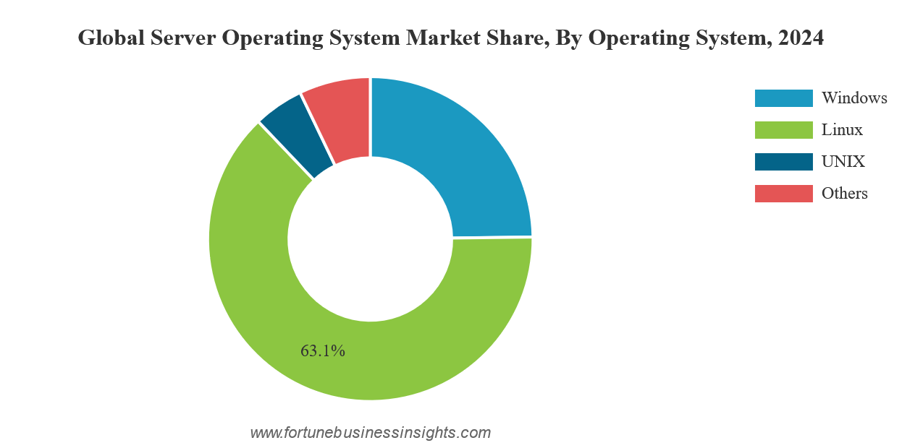
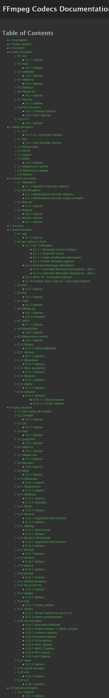
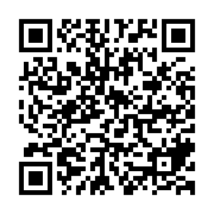

:revealjs_theme: night
:revealjs_controls: false
:revealjs_hash: true
:revealjs_width: 1664
:revealjs_height: 936
:revealjs_pdfseparatefragments: false
:revealjsdir: ./node_modules/reveal.js

= About free software
Group 4

== Part 1
Introduction

=== What *_is_* free software?

[%step]
Software that respects the user's computing freedom

=== Gratis
/ˈɡɹætɪs/

[quote,Merriam Webster]
(adj.) without charge or recompense

=== Libre
/ˈliːbɹə/

[quote,Cambridge French-English Dictionary]
(adj.) free from difficulty or obstacles

=== The four freedoms

1. To run software for any purpose.
2. To study and change source code.
3. To redistribute copies.
4. To distribute modified copies.

https://www.gnu.org/philosophy/free-sw.en.html

== Part 2
Significance

[background-color="white"]
=== So what?

[%step]
The world *literally* runs on free software

[%step]

=== *_You_* are in control

[%step]
* Right to repair
* Don't like something? Change it
* Avoid vendor lock-in
* Control your data

=== Non-free software often can't even compete
Just look at `ffmpeg`

=== or

`yt-dlp`

https://github.com/yt-dlp/yt-dlp/blob/master/supportedsites.md

`pandoc`

https://pandoc.org/index.html

`Blender`

https://www.blender.org/

`Godot Engine`

https://godotengine.org

== Part 3
Practicality (and how you can help)

=== There isn't always alternatives

image::assets/wilber-big.png[]

GIMP can't replace Photoshop

=== Your hardware also isn't libre

...and there's not much we can do about that ):

=== Easy thing to do

image::assets/firefox-logo.png[,300,300]

instead of

image::assets/chrome-logo.svg[Static,300]

=== Spread the word!

The more people know, the better

https://fsf.org

== Q&A

== Appendix

This presentation is FLOSS, made with FLOSS

https://github.com/fire-helper/slides

