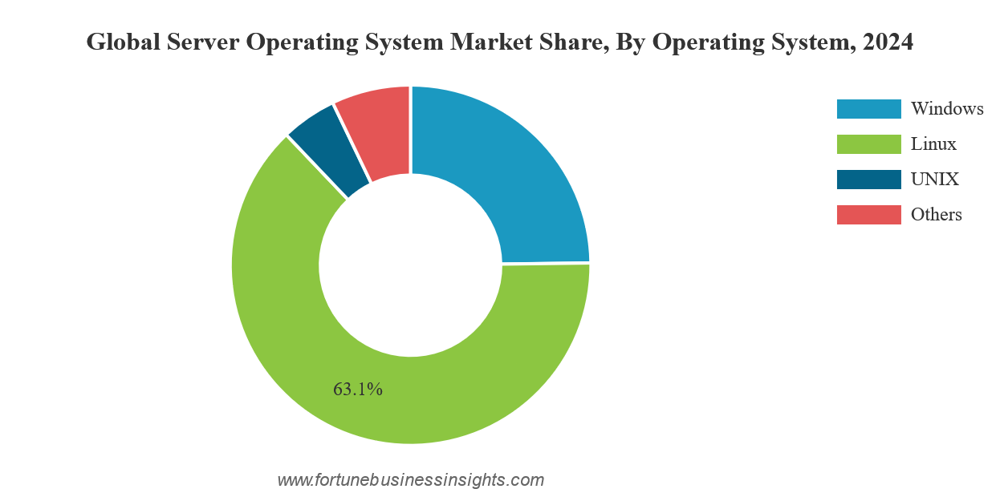

:revealjs_theme: night
:revealjs_controls: false
:revealjs_hash: true
:revealjs_width: 1664
:revealjs_height: 936
:revealjs_pdfseparatefragments: false

= About free software
Group 4

== Part 1
Introduction

=== What *_is_* free software?

[%step]
Software that respects the user's computing freedom

=== Gratis
/ˈɡɹætɪs/

[quote,Merriam Webster]
(adj.) without charge or recompense

=== Libre
/ˈliːbɹə/

[quote,Cambridge French-English Dictionary]
(adj.) free from difficulty or obstacles

=== The four freedoms

1. To run software for any purpose.
2. To study and change its source code.
3. To redistribute copies.
4. To distribute modified copies.

https://www.gnu.org/philosophy/free-sw.en.html

== Part 2
Significance

[background-color="white"]
=== So what?

[%step]
The world *literally* runs on them.

[%step]

=== It ensures your right to repair

====
Android:

* GrapheneOS
* CalyxOS
* LineageOS
====

====
Desktop:

* Linux distributions
* BSD distributions
====
